# Arquitetura do GestarAfeto

O GestarAfeto e um servico principal em camadas organizado por dominio, acompanhado de um
microsservico dedicado a alertas. A entrega TP2/PB fortaleceu a persistencia com PostgreSQL,
Flyway, Spring Data JPA, Envers e Testcontainers. A entrega TP3/PB extraiu o calculo de
alertas para um servico proprio, integrado por REST com Spring Cloud OpenFeign e circuit
breaker Resilience4j.

O detalhamento do microsservico esta em [`MICROSSERVICO_ALERTAS.md`](MICROSSERVICO_ALERTAS.md).

## Visao geral dos servicos

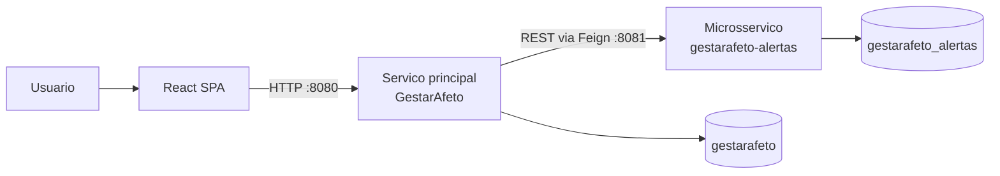

Cada servico e dono do seu banco. Nao ha FK, join ou transacao distribuida entre eles: o
microsservico guarda apenas referencias logicas (`gestante_id`, `origem_id`).

## Diagrama de componentes

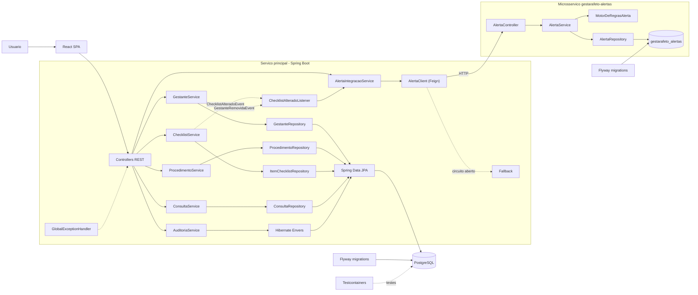

## Diagrama de camadas

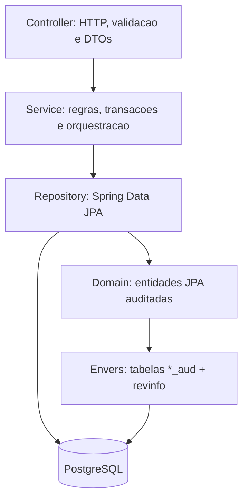

## Modelo ER

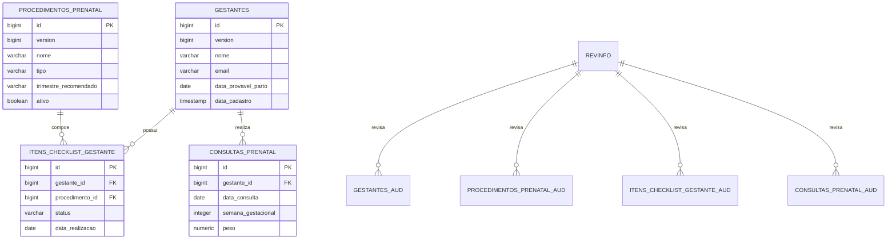

Constraints principais: `UNIQUE (gestante_id, procedimento_id)` no checklist, checks de semana gestacional, peso positivo, intervalo de semanas do procedimento e data obrigatoria quando status e `REALIZADO`.

## Modelo do microsservico de alertas

Banco separado, sem relacionamento fisico com o modelo acima. A linha tracejada indica uma
referencia **logica**, resolvida por id na aplicacao e nunca por join.

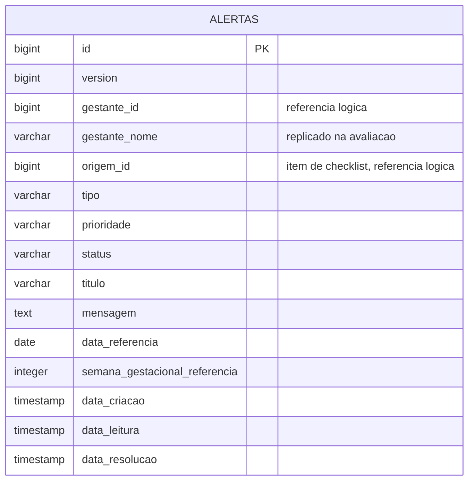

Constraints: `UNIQUE (gestante_id, origem_id, tipo)` — que torna a reavaliacao idempotente —
alem de checks para os valores de `tipo`, `prioridade` e `status`, e para a coerencia entre
status e as datas de leitura/resolucao.

## Sequencia: cadastro de gestante

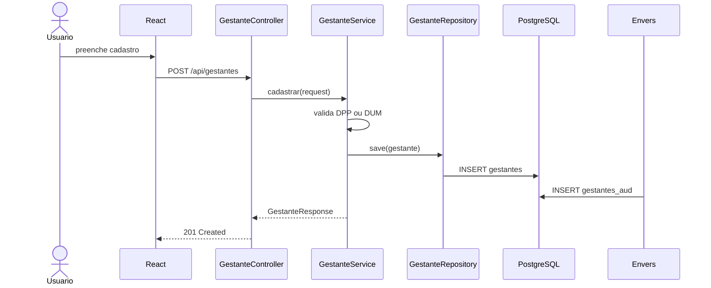

## Sequencia: geracao de checklist

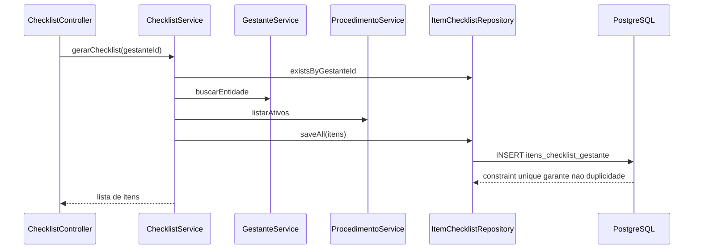

## Sequencia: historico de auditoria

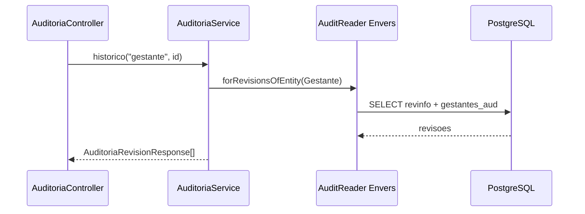

## Sequencia: atualizar status do checklist

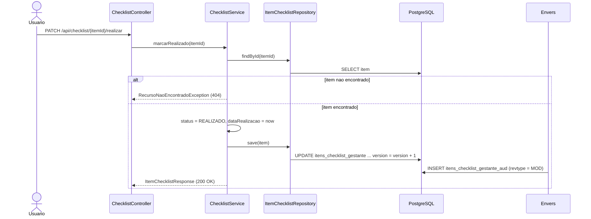

## Sequencia: concorrencia com lock otimista

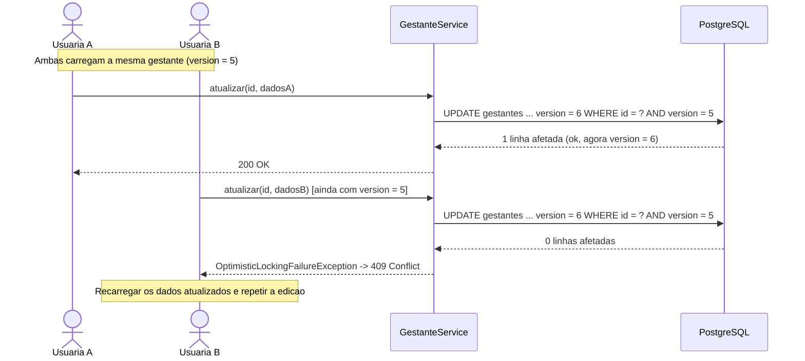

## Sequencia: avaliacao de alertas no microsservico

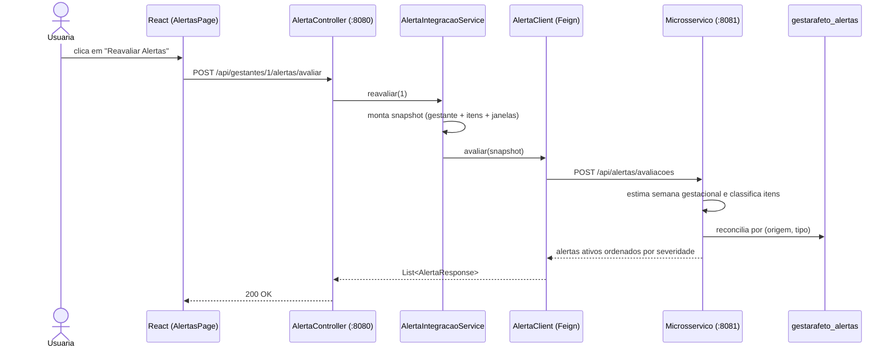

## Sequencia: sincronizacao automatica apos mudanca no checklist

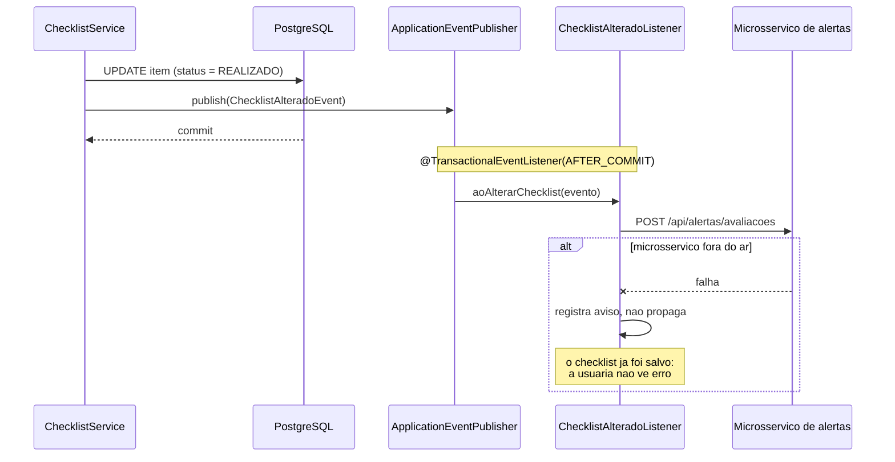

## Sequencia: microsservico indisponivel (circuit breaker)

```mermaid
sequenceDiagram
    participant FE as React
    participant AC as AlertaController
    participant CB as CircuitBreaker (Resilience4j)
    participant FB as AlertaClientFallbackFactory
    participant MS as Microsservico

    FE->>AC: GET /api/gestantes/1/alertas
    AC->>CB: listarPorGestante(1)
    CB->>MS: GET /api/alertas/gestante/1
    MS--xCB: connection refused
    CB->>FB: create(causa)
    FB-->>AC: lista vazia (degradacao)
    AC-->>FE: 200 OK com []
    Note over FE: painel vazio; o resto do<br/>sistema segue funcionando

    FE->>AC: PATCH /api/alertas/9/resolucao
    AC->>CB: resolver(9)
    CB->>FB: create(causa)
    FB--xAC: ServicoIndisponivelException
    AC-->>FE: 503 Service Unavailable
    Note over FE: acao explicita falha de forma<br/>visivel, sem fingir sucesso
```
