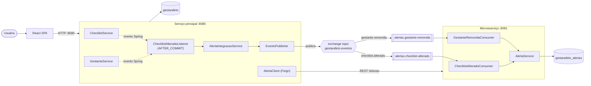
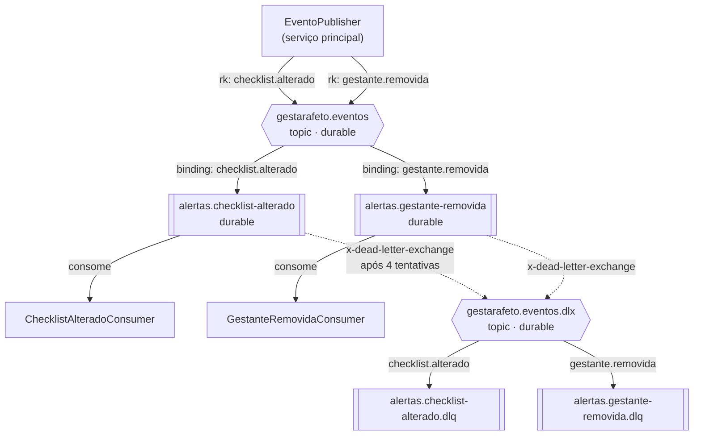
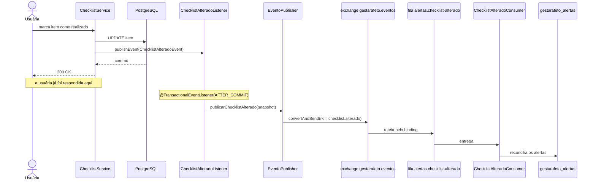
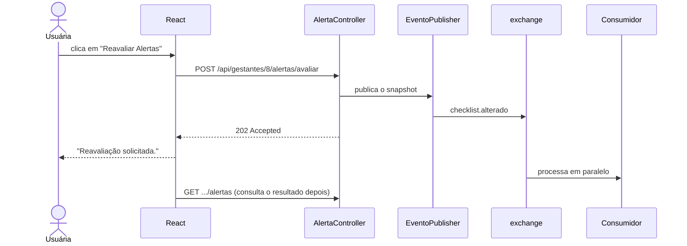
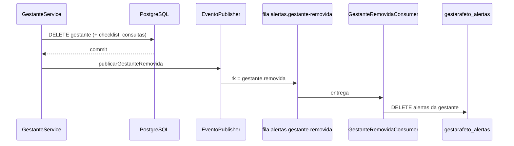
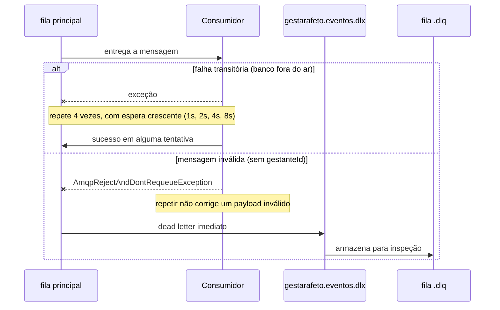

# Arquitetura orientada a eventos (RabbitMQ)

Documento principal da entrega TP4. Descreve a refatoração da comunicação entre o serviço
principal (**GestarAfeto**) e o microsserviço de alertas (**gestarafeto-alertas**), que deixou
de ser uma chamada HTTP síncrona e passou a ser troca de mensagens assíncronas via RabbitMQ.

- Broker: RabbitMQ 3.13, porta `5672`, painel em `http://localhost:15672`
- Integração: Spring Boot 4 + Spring AMQP 4 (`spring-boot-starter-amqp`)
- Código: [`mensageria/`](../src/main/java/estevezalvarez/GestarAfeto/mensageria) (produtor) ·
  [`mensageria/`](../alertas-service/src/main/java/estevezalvarez/gestarafeto/alertas/mensageria) (consumidor)

---

## 1. O que mudou, e por quê

### O acoplamento que existia

No TP3 a sincronização de alertas funcionava assim: o `ChecklistService` publicava um evento
interno do Spring, um *listener* reagia após o commit e chamava o microsserviço por HTTP
(Feign), **esperando a resposta**.

```
ChecklistService → evento Spring → listener → HTTP POST /api/alertas/avaliacoes → resposta
                                              └── bloqueado aqui ───────────────┘
```

O erro era engolido e havia circuit breaker, então a operação do usuário não quebrava. Mas
três problemas permaneciam:

| Problema | Consequência |
|---|---|
| A requisição do usuário só terminava depois da ida e volta HTTP | Latência do microsserviço somava na latência da tela |
| Com o consumidor fora do ar, o trabalho era **perdido** | O fallback devolvia vazio e ninguém reprocessava |
| O produtor precisava conhecer o endereço, o contrato REST e o estado de saúde do consumidor | Acoplamento temporal e de localização |

### O que existe agora

```
ChecklistService → evento Spring → listener → publica no RabbitMQ → retorna
                                                      ↓
                                          [fila durável no broker]
                                                      ↓
                                     microsserviço consome quando puder
```

O produtor entrega a mensagem ao broker e segue. Se o consumidor estiver fora do ar, as
mensagens **ficam na fila** e são processadas quando ele voltar. Nada se perde.

### O que continua síncrono, de propósito

A refatoração não transformou tudo em evento. A regra aplicada foi: **quem provoca trabalho
vira evento; quem precisa de resposta agora continua REST.**

| Operação | Canal | Justificativa |
|---|---|---|
| Checklist alterado | **Evento** | Provoca trabalho; ninguém está esperando o resultado na tela |
| Gestante removida | **Evento** | Idem; limpeza de dados derivados |
| Listar alertas | REST | A tela precisa da lista para renderizar |
| Resumo de alertas | REST | Idem |
| Marcar como lido / resolver | REST | A usuária precisa saber imediatamente se a ação foi aceita |

Transformar uma consulta em evento exigiria um canal de retorno e um mecanismo de correlação
para devolver a resposta à tela — complexidade sem benefício. O ganho da mensageria está na
**escrita disparada por um fato**, não na leitura sob demanda.

Isso é visível no código: a interface [`AlertaClient`](../src/main/java/estevezalvarez/GestarAfeto/alerta/client/AlertaClient.java)
encolheu. Os métodos `avaliar` e `removerPorGestante` saíram dela e viraram eventos; restaram
apenas as quatro operações síncronas.

---

## 2. Visão geral da arquitetura



### Componentes

| Componente | Serviço | Papel |
|---|---|---|
| `ChecklistService`, `GestanteService` | principal | Publicam eventos **internos** do Spring. Não conhecem RabbitMQ. |
| `ChecklistAlteradoListener` | principal | Fronteira: traduz evento de domínio em mensagem, em `AFTER_COMMIT` |
| `AlertaIntegracaoService` | principal | Monta o *snapshot* do checklist e decide o canal (evento ou REST) |
| `EventoPublisher` | principal | Único ponto que fala com o broker; padroniza envelope e trata falha |
| `RabbitProdutorConfig` | principal | Declara o exchange, o conversor JSON e os *publisher confirms* |
| `RabbitConsumidorConfig` | alertas | Declara filas, bindings, DLX/DLQ e o conversor com tipo inferido |
| `ChecklistAlteradoConsumer` | alertas | Consome `checklist.alterado` e reavalia os alertas |
| `GestanteRemovidaConsumer` | alertas | Consome `gestante.removida` e descarta os dados derivados |
| `AlertaService` | alertas | Regra de negócio já existente, agora acionada pela fila |

---

## 3. Topologia RabbitMQ



### Exchanges

| Nome | Tipo | Durável | Finalidade |
|---|---|---|---|
| `gestarafeto.eventos` | topic | sim | Todos os eventos de domínio publicados pelo serviço principal |
| `gestarafeto.eventos.dlx` | topic | sim | Dead letter: recebe o que os consumidores rejeitaram em definitivo |

**Por que `topic` e não `direct` ou `fanout`.** As routing keys seguem o padrão
`dominio.acao`. Com um exchange *topic*, um consumidor futuro pode assinar `checklist.*` ou
`gestante.#` sem que o produtor mude uma linha. Um `direct` exigiria binding exato por evento,
e um `fanout` entregaria tudo a todos, obrigando cada consumidor a filtrar o que não lhe
interessa.

### Routing keys

| Routing key | Publicada quando | Carga |
|---|---|---|
| `checklist.alterado` | Checklist gerado, item marcado como realizado, marcado para revisão ou com status atualizado; e na reavaliação sob demanda | Estado completo do checklist |
| `gestante.removida` | Gestante excluída do sistema | Apenas o identificador |

### Filas e bindings

| Fila | Exchange | Binding (routing key) | Dead letter |
|---|---|---|---|
| `alertas.checklist-alterado` | `gestarafeto.eventos` | `checklist.alterado` | `gestarafeto.eventos.dlx` / `checklist.alterado` |
| `alertas.gestante-removida` | `gestarafeto.eventos` | `gestante.removida` | `gestarafeto.eventos.dlx` / `gestante.removida` |
| `alertas.checklist-alterado.dlq` | `gestarafeto.eventos.dlx` | `checklist.alterado` | — |
| `alertas.gestante-removida.dlq` | `gestarafeto.eventos.dlx` | `gestante.removida` | — |

**Uma fila por evento, e não uma fila única.** Assim uma mensagem de checklist travada não
atrasa a limpeza de uma gestante removida, e cada fluxo pode ter concorrência e política de
repetição próprias.

**Quem declara o quê.** O produtor declara **apenas o exchange**; filas e bindings são
declarados pelo **consumidor**. É essa divisão que permite acrescentar um novo consumidor sem
tocar no produtor. Toda a topologia é criada em código pelo `RabbitAdmin` na subida — não há
passo manual de configuração no broker.

---

## 4. Estrutura das mensagens

Todas as mensagens trafegam em **JSON**, e não em serialização binária Java. JSON é legível no
painel do broker, independente de linguagem e não amarra os dois lados às mesmas classes.

### Envelope comum

Os cinco primeiros campos são iguais em todos os eventos:

| Campo | Tipo | Para que serve |
|---|---|---|
| `eventoId` | UUID (string) | Identifica a ocorrência. Aparece no log dos dois lados, permitindo rastrear a mensagem ponta a ponta. Base para deduplicação. |
| `tipo` | string | Identifica o evento **sem depender do nome da classe Java** |
| `versao` | inteiro | Permite evoluir o contrato mantendo consumidores antigos |
| `ocorridoEm` | ISO-8601 | Quando o fato aconteceu (não quando foi consumido) |
| `origem` | string | Serviço emissor |

### `checklist.alterado`

```json
{
  "eventoId": "3c0f58cc-be6b-47d1-85b0-040c5f5ffccc",
  "tipo": "CHECKLIST_ALTERADO",
  "versao": 1,
  "ocorridoEm": "2026-09-25T10:50:17.106Z",
  "origem": "gestarafeto-principal",
  "gestanteId": 8,
  "gestanteNome": "Maria Silva",
  "dataUltimaMenstruacao": "2026-04-02",
  "dataProvavelParto": null,
  "itens": [
    {
      "itemId": 34,
      "procedimentoNome": "Ultrassonografia Morfologica",
      "procedimentoTipo": "ULTRASSONOGRAFIA",
      "status": "PENDENTE",
      "obrigatorio": true,
      "semanaInicialRecomendada": 20,
      "semanaFinalRecomendada": 24,
      "dataRealizacao": null
    }
  ]
}
```

**A mensagem carrega o estado completo, e não apenas o `gestanteId`.** Essa é a decisão mais
importante do desenho. Se levasse só o identificador, o consumidor teria de chamar o produtor
de volta para buscar o checklist — e voltaríamos a depender de o produtor estar no ar no
momento do consumo, recriando o acoplamento que a refatoração eliminou.

O custo é uma mensagem maior (~23 itens por gestante) e a possibilidade de processar um estado
já desatualizado, se duas alterações ocorrerem em sequência. O segundo ponto é inofensivo aqui
porque a reconciliação é idempotente: a última mensagem processada estabelece o estado final.

**Por que `status` e `procedimentoTipo` são texto e não enums.** Os dois serviços evoluem seus
enums de forma independente. Um valor novo enviado por uma versão mais recente do produtor não
pode impedir a desserialização da mensagem inteira.

### `gestante.removida`

```json
{
  "eventoId": "5a68d346-039e-4997-bebb-2dd82cabb049",
  "tipo": "GESTANTE_REMOVIDA",
  "versao": 1,
  "ocorridoEm": "2026-09-25T10:52:33.177Z",
  "origem": "gestarafeto-principal",
  "gestanteId": 8
}
```

Aqui o identificador basta: a instrução é "esqueça tudo desta gestante", não há estado a
transportar.

---

## 5. Integração com Spring Boot e Spring AMQP

### Publicação

`RabbitTemplate` com `JacksonJsonMessageConverter` (a variante para Jackson 3, usado pelo
Spring Boot 4). A publicação é uma linha:

```java
rabbitTemplate.convertAndSend(
    TopologiaEventos.EXCHANGE, routingKey, mensagem, new CorrelationData(eventoId));
```

### Consumo

`@RabbitListener` recebe o objeto já desserializado — não há código de parsing:

```java
@RabbitListener(queues = TopologiaEventos.FILA_CHECKLIST_ALTERADO)
public void consumir(ChecklistAlteradoMessage mensagem) { ... }
```

### Um detalhe que exigiu configuração explícita

Por padrão, o conversor Jackson do Spring AMQP usa o cabeçalho `__TypeId__` enviado pelo
produtor, que carrega o **nome da classe Java dele**
(`estevezalvarez.GestarAfeto.mensageria.evento.ChecklistAlteradoMessage`). Essa classe não
existe no microsserviço, e a desserialização falharia.

A solução foi configurar o mapeador de tipos com precedência **`INFERRED`**:

```java
DefaultJacksonJavaTypeMapper mapper = new DefaultJacksonJavaTypeMapper();
mapper.setTypePrecedence(JacksonJavaTypeMapper.TypePrecedence.INFERRED);
converter.setJavaTypeMapper(mapper);
```

Com isso o cabeçalho é ignorado e o alvo passa a ser o tipo do parâmetro do método anotado.
Os dois lados ficam livres para nomear e empacotar suas classes como quiserem: **o contrato é
o JSON, não a classe Java.** O teste `EventoRabbitMqIntegrationTest` publica as mensagens como
mapas, sem nenhuma classe do produtor no classpath, justamente para provar isso.

---

## 6. Fluxos de eventos

### 6.1 Checklist alterado



O ponto central: a usuária é respondida **antes** de o consumidor sequer receber a mensagem.

**Por que `AFTER_COMMIT`.** Publicar antes do commit anunciaria uma alteração que a transação
ainda poderia desfazer, e o consumidor processaria um estado que nunca existiu.

### 6.2 Reavaliação sob demanda (HTTP 202)



O endpoint responde **202 Accepted**, e não 200: o serviço apenas aceitou a solicitação.
Devolver 200 com a lista daria a entender que o processamento já terminou.

### 6.3 Gestante removida



Esta limpeza é a contrapartida da ausência de chave estrangeira entre os bancos: sem *cascade*
no banco, quem apaga os dados derivados é a aplicação, reagindo ao fato.

### 6.4 Falha e dead letter



A distinção importa: falha transitória merece repetição; mensagem malformada não. Rejeitar sem
reenfileirar manda o payload inválido direto para a DLQ, em vez de consumir as tentativas e
atrasar as mensagens seguintes da fila.

---

## 7. Tratamento de falhas e garantias

| Mecanismo | Onde | O que protege |
|---|---|---|
| **Publisher confirms** (`publisher-confirm-type=correlated`) | produtor | O broker avisa se não conseguiu aceitar a mensagem |
| **Publisher returns** (`mandatory=true`) | produtor | Avisa se a mensagem não pôde ser roteada para nenhuma fila (routing key errada) |
| **Retry na publicação** (3 tentativas, 500ms → 2s) | produtor | Instabilidade momentânea de rede |
| **Filas e mensagens duráveis** | broker | Sobrevivem ao reinício do broker |
| **Ack após o método retornar** | consumidor | Se o serviço cair durante o processamento, a mensagem volta para a fila |
| **Retry no consumo** (4 tentativas, 1s → 10s) | consumidor | Falha transitória, como banco indisponível |
| **DLQ** | broker | Mensagens que falharam em definitivo ficam guardadas para inspeção |
| **Idempotência** | consumidor | Reentrega não duplica alertas |

### Idempotência

O RabbitMQ garante entrega **ao menos uma vez**: após uma falha de rede, a mesma mensagem pode
ser reentregue. O consumo precisa ser seguro nessa condição.

Aqui ele é, e sem código adicional: a reconciliação do `AlertaService` identifica cada alerta
pelo par *(item de origem, tipo)* e **atualiza em vez de inserir**, garantia reforçada no banco
pela constraint `UNIQUE (gestante_id, origem_id, tipo)`. Processar a mesma mensagem duas vezes
produz exatamente o mesmo estado.

### A janela de perda que permanece

A publicação acontece **depois** do commit da operação de domínio. Se o broker estiver
indisponível exatamente nesse instante, a mensagem se perde: a operação do usuário já foi
concluída com sucesso e não pode ser revertida por causa de um efeito colateral.

O impacto é limitado, porque o estado se recompõe na próxima alteração do checklist ou numa
reavaliação manual — o processamento é idempotente e a mensagem seguinte carrega o estado
completo. Eliminar a janela por completo exigiria um **outbox transacional**: gravar a mensagem
na mesma transação do dado, em uma tabela, e publicá-la depois com um processo separado.
Está registrado como evolução, não foi implementado nesta entrega.

---

## 8. Vantagens e limitações no contexto deste projeto

### Vantagens observadas

| Característica | Como aparece aqui |
|---|---|
| **Desacoplamento** | O produtor não conhece endereço, contrato REST nem estado de saúde do consumidor. Conhece um exchange e uma routing key. |
| **Processamento assíncrono** | A requisição do usuário termina sem esperar o cálculo dos alertas, que envolve ~23 itens por gestante. |
| **Resiliência** | Com o consumidor fora do ar, as mensagens se acumulam na fila e são processadas quando ele volta. No TP3, esse trabalho era perdido. |
| **Escalabilidade** | Subir mais instâncias do microsserviço distribui as mensagens da fila automaticamente, sem configuração no produtor. O `prefetch` e a concorrência (1 a 4 *threads*) controlam o ritmo. |
| **Extensibilidade** | Um serviço novo (relatórios, notificação por e-mail) se vincula ao mesmo exchange com a própria fila. O produtor não muda. |

### Limitações assumidas

| Limitação | Impacto | Mitigação adotada |
|---|---|---|
| **Consistência eventual** | Os alertas podem ficar defasados por instantes após uma alteração | Aceito: nenhuma decisão clínica depende do alerta estar atualizado no mesmo segundo. A interface informa que a atualização vem "em instantes". |
| **Complexidade operacional** | Um componente a mais para instalar, monitorar e manter | O broker sobe junto no `compose.yaml`, e o painel em `:15672` dá visibilidade sem ferramenta extra |
| **Depuração mais difícil** | O fluxo deixa de ser uma pilha de chamadas | Todo evento carrega `eventoId`, registrado no log dos dois lados |
| **Entrega ao menos uma vez** | A mesma mensagem pode chegar duas vezes | O consumo é idempotente por construção |
| **Ordem não garantida entre filas** | Duas alterações rápidas podem ser processadas fora de ordem | A mensagem carrega o estado completo: a última processada estabelece o estado final |
| **Janela de perda na publicação** | Broker fora do ar no instante exato da publicação | Documentada acima; outbox transacional como evolução |

### Quando a arquitetura orientada a eventos **não** é adequada

O próprio projeto tem exemplos. Listar alertas e marcar um alerta como lido continuam
síncronos porque exigem resposta imediata para a tela. Transformá-los em evento exigiria um
canal de retorno e correlação, trocando uma chamada simples por uma coreografia — mais partes
móveis para resolver um problema que não existia.

---

## 9. Execução e verificação

### Subir o ambiente

```powershell
docker compose up -d          # postgres x2 + rabbitmq
```

```powershell
.\mvnw.cmd spring-boot:run -Dspring-boot.run.profiles=dev
```

```powershell
cd alertas-service
.\mvnw.cmd spring-boot:run -Dspring-boot.run.profiles=dev
```

### Conferir a topologia criada

```powershell
docker exec gestarafeto-rabbitmq rabbitmqctl list_exchanges name type
docker exec gestarafeto-rabbitmq rabbitmqctl list_queues name messages consumers
docker exec gestarafeto-rabbitmq rabbitmqctl list_bindings source_name destination_name routing_key
```

Painel web: `http://localhost:15672` (usuário e senha `gestarafeto`).

### Evidência de execução real

Publicação e consumo do mesmo evento, capturados dos logs dos dois serviços:

```
# serviço principal
INFO e.G.mensageria.EventoPublisher : Evento publicado.
     tipo=CHECKLIST_ALTERADO eventoId=3c0f58cc-be6b-47d1-85b0-040c5f5ffccc
     gestanteId=8 routingKey=checklist.alterado

# microsserviço
INFO e.g.a.m.c.ChecklistAlteradoConsumer : Evento recebido.
     tipo=CHECKLIST_ALTERADO eventoId=3c0f58cc-be6b-47d1-85b0-040c5f5ffccc
     gestanteId=8 itens=23
INFO e.g.a.m.c.ChecklistAlteradoConsumer : Evento processado.
     eventoId=3c0f58cc-be6b-47d1-85b0-040c5f5ffccc gestanteId=8 alertasAtivos=22
```

Independência entre produtor e consumidor, com o microsserviço **encerrado**:

```
marcar item realizado   -> HTTP 200
POST .../alertas/avaliar -> HTTP 202  {"status":"ACEITO", ...}
marcar item p/ revisao  -> HTTP 200

$ rabbitmqctl list_queues name messages consumers
alertas.checklist-alterado    3    0      <- 3 mensagens, nenhum consumidor
```

Após religar o microsserviço, as três mensagens foram processadas em sequência e o estado
reconciliou sozinho.

---

## 10. Testes

| Classe | Serviço | O que valida |
|---|---|---|
| `AlertaIntegracaoServiceTest` | principal | Conteúdo da mensagem publicada: estado completo do checklist e envelope de rastreamento |
| `ChecklistAlteradoListenerTest` | principal | Alterações de domínio viram eventos em `AFTER_COMMIT`; falha ao publicar não quebra a operação |
| `AlertaControllerTest` | principal | A reavaliação responde 202 e publica; gestante inexistente retorna 404 sem publicar |
| `ChecklistAlteradoConsumerTest` | alertas | Tradução da mensagem, idempotência e rejeição para DLQ |
| `GestanteRemovidaConsumerTest` | alertas | Limpeza dos dados derivados e idempotência |
| `EventoRabbitMqIntegrationTest` | alertas | **Broker real (Testcontainers)**: topologia declarada, publicação → roteamento → fila → consumo, routing key não vinculada, e mensagem inválida terminando na DLQ |

Detalhes em [`TESTING.md`](TESTING.md).
