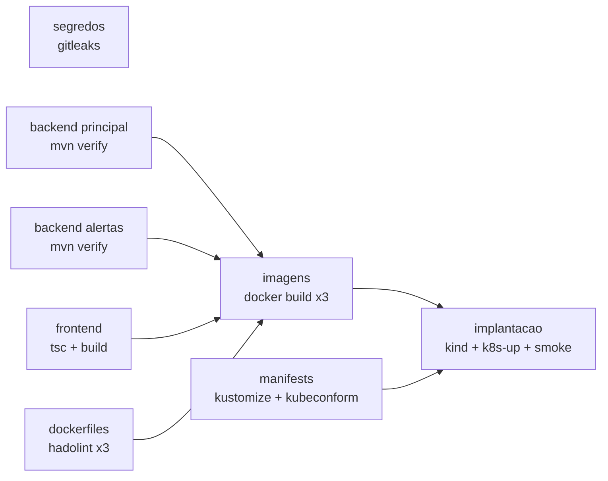

# CI/CD com GitHub Actions

> **Estado:** o **CI foi executado no GitHub e passou** (branch `tp5-implementa`, execucao
> [37968816437](https://github.com/EstevezCodando/GestarAfeto/actions/runs/37968816437): 12 jobs
> verdes, incluindo a implantacao em kind). A primeira execucao falhou com `exit code 126` nos
> dois backends porque `mvnw` entrou no Git sem permissao de execucao (`100644`, efeito do
> Windows); corrigido com `git update-index --chmod=+x`. O **CD ainda nao foi executado**: so
> dispara em tag `vX.Y.Z` (ou manualmente) e publica imagens no GHCR; foi validado apenas
> estaticamente (`actionlint`).

## 1. CI — `.github/workflows/ci.yml`

Dispara em `push` (qualquer branch), `pull_request` e manualmente. Permissao global
`contents: read`. Uma nova execucao na mesma branch cancela a anterior.



| Job | Faz | Reprova quando |
|---|---|---|
| `segredos` | `gitleaks` em todo o historico | encontra credencial |
| `backend` (matriz) | `./mvnw verify`: compila, roda os testes (Testcontainers com o Docker do runner), gera cobertura JaCoCo e roda o Checkstyle | teste falha ou ha violacao |
| `frontend` | `npm ci`, `tsc --noEmit` (strict, sem variaveis nao usadas), `vite build` | erro de tipo ou de build |
| `dockerfiles` | `hadolint` (limiar *warning*) | qualquer aviso |
| `manifests` | `kubectl kustomize` + `kubeconform -strict` | manifest invalido para o esquema do Kubernetes |
| `imagens` | `docker buildx build` das 3 imagens, sem publicar | build falha |
| `implantacao` | sobe um cluster **kind**, constroi e carrega as imagens, roda `k8s-up.sh` e o `smoke.sh` ponta a ponta | rollout nao conclui ou o fluxo API → RabbitMQ → alertas quebra |

Os relatorios (`surefire`, `jacoco`) sao publicados como artefatos, e cada job de backend grava
no resumo da execucao a contagem de testes executados/aprovados/falhos/ignorados.

## 2. CD — `.github/workflows/cd.yml`

Dispara em tag `vX.Y.Z` ou manualmente (`workflow_dispatch` com a versao).

| Etapa | Detalhe |
|---|---|
| `versao` | Extrai a versao da tag e valida o formato semver |
| `validar` | Renderiza e valida os manifests (kubeconform) |
| `publicar` | Constroi e envia as 3 imagens ao **GHCR** com tags `X.Y.Z` e `sha-<commit>` e labels OCI. Usa `GITHUB_TOKEN`, entao nao exige nenhum segredo a configurar |
| `implantar` | Puxa as imagens **recem-publicadas**, as entrega a um cluster kind, executa `k8s-up.sh`, espera os rollouts e roda o smoke test. Registra o resultado no resumo da execucao |
| `release` | So em tag: renderiza os manifests com as imagens publicadas e os anexa ao GitHub Release (`gestarafeto-X.Y.Z.yaml`, pronto para `kubectl apply -f`) |

O "ambiente autorizado" aqui e o kind efemero do runner: o projeto nao possui um cluster
remoto. Em um cluster real, a etapa `implantar` troca o kind por `kubeconfig` guardado em um
*GitHub Secret*/*Environment* com aprovacao manual; o resto permanece igual.

### Permissoes e segredos

| Workflow/job | Permissoes |
|---|---|
| CI (todos os jobs) | `contents: read` |
| CD `publicar` | `contents: read`, `packages: write` |
| CD `implantar` | `contents: read`, `packages: read` |
| CD `release` | `contents: write` (criar o Release) |

Nao ha segredo cadastrado manualmente: so o `GITHUB_TOKEN` automatico. As senhas do cluster
(bancos, RabbitMQ, Grafana) sao geradas dentro do proprio job pelo `k8s-up.sh`.

Apos a primeira publicacao, os pacotes no GHCR nascem **privados**: torne-os publicos (ou
conceda acesso) em *Packages → Package settings* se for puxa-los fora do repositorio.

## 3. Como reproduzir cada job localmente

| Job | Comando local |
|---|---|
| segredos | `docker run --rm -v "$PWD:/repo" ghcr.io/gitleaks/gitleaks:v8.24.2 detect --source /repo --no-banner --redact` |
| backend principal | `./mvnw -B verify` |
| backend alertas | `cd alertas-service && ./mvnw -B verify` |
| frontend | `cd frontend && npm ci && npm run typecheck && npm run build` |
| dockerfiles | `docker run --rm -i hadolint/hadolint hadolint --failure-threshold warning - < Dockerfile` |
| manifests | `kubectl kustomize k8s/overlays/local \| docker run --rm -i ghcr.io/yannh/kubeconform -strict -summary -kubernetes-version 1.31.0 -` |
| workflows | `docker run --rm -v "$PWD:/repo" -w /repo rhysd/actionlint` |
| implantacao | `bash scripts/k8s-build-load.sh && bash scripts/k8s-up.sh && bash scripts/smoke.sh` (com `port-forward`) |

## 4. Como validar o CD (passo que falta)

O CI ja foi validado (ver o topo). Falta executar o CD, o que **publica imagens no GHCR e cria
um Release** (acoes visiveis publicamente), por isso nao foi disparado sem autorizacao:

```bash
git tag v5.0.0 && git push origin v5.0.0       # dispara o CD (publica imagens + Release)
```

Confira a aba *Actions* (5 jobs) e, se quiser os pacotes publicos, ajuste a visibilidade em
*Packages*. So entao R5 passa a "Validado" por completo.

## 5. Limitacoes

- Actions referenciadas por tag de versao (`@v4`), nao por SHA. Em ambiente de alto risco,
  fixar por SHA e habilitar o Dependabot para `github-actions`.
- O job `implantacao` consome CPU/memoria (cerca de 1,4 CPU e 2,7 GB de *requests*); em runner
  de 2 vCPU a subida pode ser lenta (os *startup probes* toleram ate 5 min).
- Nao ha varredura de vulnerabilidades das imagens (Trivy/Grype) nem assinatura (cosign).
- NetworkPolicy no kind do CI pode nao ser aplicada (depende do CNI); o teste de isolamento
  foi feito apenas no Docker Desktop.
