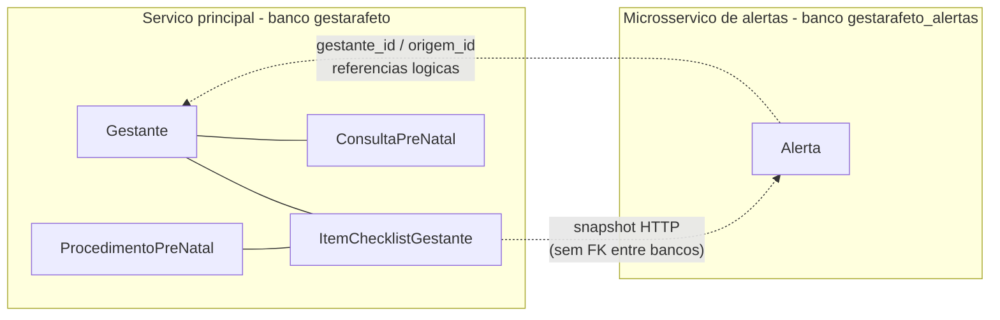
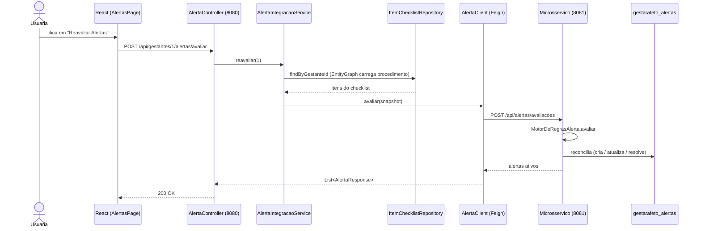
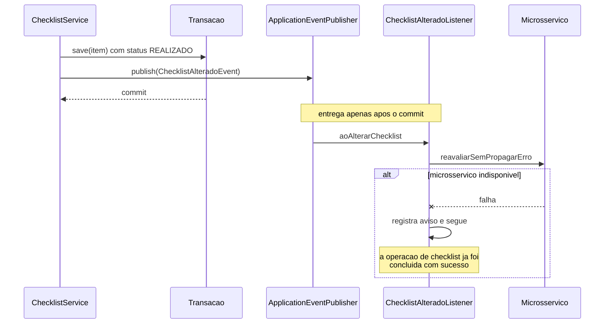
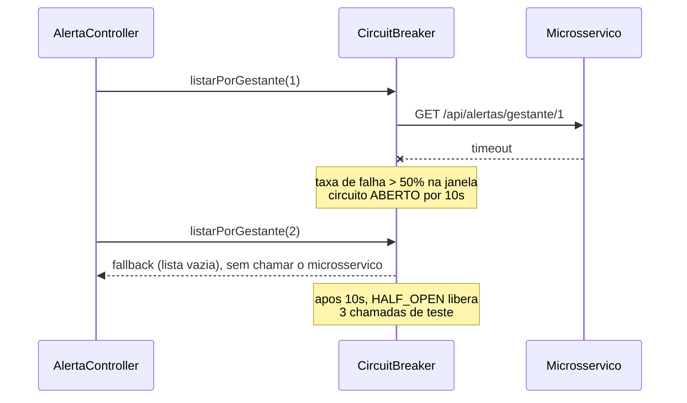
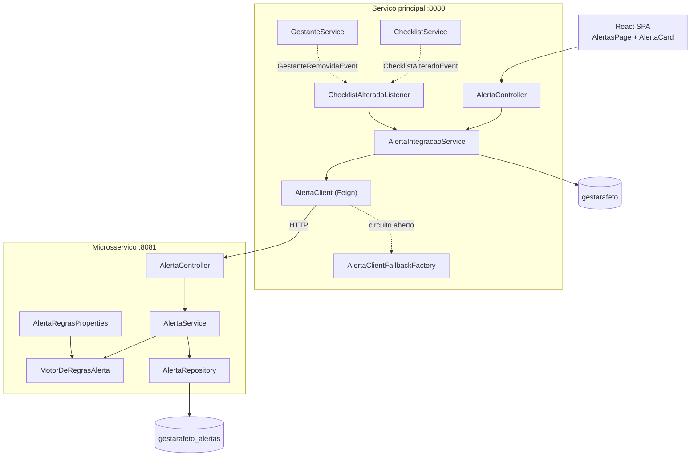

# Microsservico de Alertas (`gestarafeto-alertas`)

Servico independente que transforma o checklist pre-natal de uma gestante em uma lista
priorizada de alertas. Roda em processo, porta e banco proprios, e se comunica com o servico
principal exclusivamente por HTTP.

- Codigo: [`alertas-service/`](../alertas-service)
- Porta padrao: `8081`
- Banco: `gestarafeto_alertas` (PostgreSQL na porta `5433`)

## Por que este recorte

O calculo de alertas e o unico pedaco do sistema que satisfaz simultaneamente tres criterios
que justificam um servico separado:

| Criterio | Evidencia |
|---|---|
| **Dados proprios** | Alertas nao pertencem a nenhuma tabela existente: tem ciclo de vida (aberto, lido, resolvido) e historico de leitura que o checklist nao modela. |
| **Regra volatil** | As janelas recomendadas e os limiares de prioridade mudam conforme protocolos clinicos, em ritmo diferente do cadastro de gestantes. |
| **Carga assimetrica** | A reavaliacao e um processamento em lote sobre todo o checklist, disparado com frequencia muito maior que as escritas do cadastro. |

O cadastro de gestantes, ao contrario, e o nucleo transacional do sistema: separa-lo criaria
consistencia eventual sobre dados que precisam de integridade forte.

## Modelo de dominio atualizado

O contexto de alertas e um **bounded context** proprio. Ele nao enxerga `Gestante`,
`ProcedimentoPreNatal` nem `ItemChecklistGestante`: recebe um recorte desses dados
(`ItemChecklistSnapshot`) e mantem apenas o que e seu.



### Entidade `Alerta`

| Campo | Papel |
|---|---|
| `gestanteId` | Referencia logica a gestante no servico principal. Sem FK. |
| `gestanteNome` | Replicado na avaliacao, para listar alertas sem chamar o servico principal de volta. |
| `origemId` | Id do item de checklist que originou o alerta. |
| `tipo` | `PROCEDIMENTO_ATRASADO`, `PROCEDIMENTO_PENDENTE`, `JANELA_PROXIMA`, `REVISAO_SOLICITADA`. |
| `prioridade` | `ALTA`, `MEDIA`, `BAIXA`. |
| `status` | `ABERTO`, `LIDO`, `RESOLVIDO`, `CANCELADO`. |
| `dataReferencia` | Data estimada do procedimento, quando a DUM e conhecida. |
| `version` | Lock otimista, como nas entidades do servico principal. |

A constraint `uk_alerta_origem_tipo (gestante_id, origem_id, tipo)` e o que torna a
reavaliacao idempotente: cada par item/motivo tem no maximo uma linha.

### Consistencia entre servicos

Os dados sao **eventualmente consistentes**. Se o microsservico estiver fora do ar quando o
checklist mudar, os alertas ficam defasados ate a proxima reavaliacao — que e idempotente e
reconcilia tudo de uma vez. Nenhuma decisao clinica depende do alerta estar atualizado no
mesmo instante, entao essa troca e aceitavel; em compensacao, o cadastro de gestantes nunca
fica indisponivel por causa do servico de alertas.

## Regra de negocio

`MotorDeRegrasAlerta` e uma classe sem estado e sem acesso a banco, o que a torna testavel
isoladamente ([`MotorDeRegrasAlertaTest`](../alertas-service/src/test/java/estevezalvarez/gestarafeto/alertas/service/MotorDeRegrasAlertaTest.java)).

**Semana gestacional.** Calculada a partir da DUM (`semanas completas + 1`). Sem DUM, e
derivada da DPP (`total - semanas restantes`). Sem nenhuma das duas, as regras baseadas em
janela nao se aplicam. O resultado e limitado a 1..42.

**Classificacao de cada item:**

| Situacao do item | Tipo | Prioridade |
|---|---|---|
| `PRECISA_REVISAR` | `REVISAO_SOLICITADA` | ALTA |
| `PENDENTE`, semana atual > semana final | `PROCEDIMENTO_ATRASADO` | ALTA se obrigatorio, senao MEDIA |
| `PENDENTE`, semana atual dentro da janela | `PROCEDIMENTO_PENDENTE` | MEDIA se obrigatorio, senao BAIXA |
| `PENDENTE`, janela comeca em ate `antecedenciaSemanas` | `JANELA_PROXIMA` | BAIXA |
| `REALIZADO` ou `NAO_SE_APLICA` | — | alerta existente e resolvido |

**Reconciliacao.** `AlertaService.avaliar` compara o resultado do motor com o que ja esta
gravado, pela chave `(origemId, tipo)`:

- desejado e inexistente → cria como `ABERTO`;
- desejado e existente → atualiza texto e prioridade, **preservando** se ja estava `LIDO`;
- desejado e existente porem encerrado → reabre;
- gravado e nao mais desejado → marca `RESOLVIDO` (nunca apaga).

## Endpoints

### API do microsservico (`http://localhost:8081`)

| Metodo | Rota | Descricao |
|---|---|---|
| `POST` | `/api/alertas/avaliacoes` | Reavalia o checklist de uma gestante. Idempotente. |
| `GET` | `/api/alertas?gestanteId=&status=&prioridade=&page=&size=` | Listagem paginada com filtros. |
| `GET` | `/api/alertas/gestante/{gestanteId}` | Alertas ativos, ordenados por severidade. |
| `GET` | `/api/alertas/gestante/{gestanteId}/resumo` | Contagens agregadas por prioridade e status. |
| `GET` | `/api/alertas/{id}` | Detalhe de um alerta. |
| `PATCH` | `/api/alertas/{id}/leitura` | Marca como lido. |
| `PATCH` | `/api/alertas/{id}/resolucao` | Resolve manualmente. |
| `PATCH` | `/api/alertas/{id}/cancelamento` | Descarta o alerta. |
| `DELETE` | `/api/alertas/gestante/{gestanteId}` | Remove todos os alertas da gestante. |
| `GET` | `/actuator/health` | Health check. |
| `POST` | `/actuator/refresh` | Reaplica a configuracao das regras sem reiniciar. |

### Fachada no servico principal (`http://localhost:8080`)

O front-end nao fala com o microsservico diretamente. Isso mantem uma unica origem HTTP no
navegador, concentra o tratamento de erro e permite validar a existencia da gestante antes de
encaminhar a chamada.

| Metodo | Rota | Descricao |
|---|---|---|
| `POST` | `/api/gestantes/{gestanteId}/alertas/avaliar` | Monta o snapshot do checklist e reavalia. |
| `GET` | `/api/gestantes/{gestanteId}/alertas` | Alertas ativos da gestante. |
| `GET` | `/api/gestantes/{gestanteId}/alertas/resumo` | Resumo agregado. |
| `PATCH` | `/api/alertas/{alertaId}/leitura` | Encaminha a marcacao de leitura. |
| `PATCH` | `/api/alertas/{alertaId}/resolucao` | Encaminha a resolucao. |

Exemplos de payload estao em [`API_EXAMPLES.md`](API_EXAMPLES.md).

## Uso do Spring Cloud

| Componente | Onde | Para que |
|---|---|---|
| **OpenFeign** | servico principal | `AlertaClient` declara o contrato remoto como uma interface Java; o Feign gera a implementacao HTTP. |
| **CircuitBreaker (Resilience4j)** | servico principal | Interrompe chamadas a um microsservico que ja se mostrou indisponivel e ativa o fallback. |
| **spring-cloud-context** | microsservico | `ConfigurationPropertiesRebinder` reaplica `AlertaRegrasProperties` em `POST /actuator/refresh`. |
| **spring-cloud-config (cliente)** | microsservico | Preparado para buscar configuracao de um Config Server. Desligado por padrao. |

### Configuracao distribuida

Os parametros do motor de regras sao externalizados:

```properties
gestarafeto.alertas.regras.antecedencia-semanas=2
gestarafeto.alertas.regras.semanas-gestacao-total=40
gestarafeto.alertas.regras.alertar-nao-obrigatorios=true
```

Com um Config Server no ar (`GESTARAFETO_CONFIG_ENABLED=true`), um `POST /actuator/refresh`
reaplica os valores **sem reiniciar** o servico. O rebind acontece sobre a mesma instancia do
bean, entao o `MotorDeRegrasAlerta` passa a usar os novos limiares imediatamente.

O import usa o prefixo `optional:`, portanto a ausencia do Config Server nunca impede a
inicializacao — o servico simplesmente usa o `application.properties` local.

### Resiliencia: degradacao assimetrica

O fallback (`AlertaClientFallbackFactory`) trata leituras e escritas de forma diferente, de
proposito:

- **Leituras e reavaliacoes** devolvem vazio. O acompanhamento pre-natal continua funcionando
  sem o painel de alertas, que e complementar.
- **Acoes explicitas da usuaria** (marcar como lido, resolver) falham com **503**. Fingir
  sucesso faria a interface exibir um estado que o microsservico nunca registrou.
- **Remocao de alertas** apenas registra aviso: um servico auxiliar nao pode bloquear a
  exclusao de uma gestante.

## Fluxo de integracao

### Reavaliacao sob demanda



### Sincronizacao automatica por evento

O `ChecklistService` nao conhece alertas: apenas publica `ChecklistAlteradoEvent`. O listener
reage em `AFTER_COMMIT`, garantindo que o microsservico so seja chamado depois que a alteracao
esta gravada — e nunca dentro de uma transacao aberta.



### Circuit breaker aberto



## Componentes



## Execucao

```powershell
docker compose up -d
```

Sobe os dois bancos. Em seguida, cada servico em um terminal:

```powershell
.\mvnw.cmd spring-boot:run -Dspring-boot.run.profiles=dev
```

```powershell
cd alertas-service
.\mvnw.cmd spring-boot:run -Dspring-boot.run.profiles=dev
```

Sem Docker, os dois aceitam o profile `dev-h2` e sobem com banco em memoria.

O servico principal funciona normalmente com o microsservico desligado: a aba **Alertas**
apenas aparece vazia. Para desativar tambem a sincronizacao automatica:

```properties
gestarafeto.alertas.integracao-automatica=false
```

## Testes

44 testes no microsservico e 14 no servico principal cobrem esta entrega. Detalhes em
[`TESTING.md`](TESTING.md).

## Nota de implementacao: o verbo PATCH e o cliente Feign

As transicoes de estado do alerta (`/leitura`, `/resolucao`, `/cancelamento`) usam `PATCH`, que
e o verbo correto para uma alteracao parcial de estado. Com os dois servicos no ar, essas
chamadas falhavam com `Invalid HTTP method: PATCH` e caiam no fallback, apesar de o
microsservico responder normalmente quando chamado direto.

A causa e que o cliente HTTP padrao do Feign usa `java.net.HttpURLConnection`, que **nao
suporta PATCH**. A correcao preserva a semantica REST e troca o cliente:

```xml
<dependency>
    <groupId>io.github.openfeign</groupId>
    <artifactId>feign-hc5</artifactId>
</dependency>
```

```properties
spring.cloud.openfeign.httpclient.hc5.enabled=true
```

O defeito passou pelos testes de integracao porque todos substituem o `AlertaClient` por um
mock. `AlertaClientHttpTest` cobre essa lacuna exercitando o Feign real contra um servidor HTTP
em memoria e verificando o verbo trafegado.
