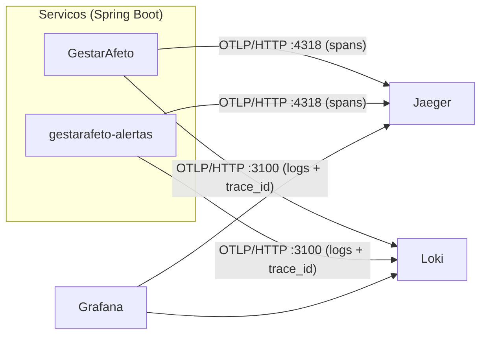

# Observabilidade: logs centralizados e rastreamento distribuido

## 1. O que existe

| Necessidade | Solucao | Onde olhar |
|---|---|---|
| Instrumentacao | **OpenTelemetry** via `spring-boot-starter-opentelemetry` (Micrometer Tracing com ponte OTel) | `pom.xml` dos dois servicos |
| Rastreamento distribuido | **Jaeger v2**, recebendo OTLP/HTTP | Jaeger UI |
| Logs centralizados | **Grafana Loki 3**, recebendo OTLP/HTTP (`/otlp/v1/logs`) | Grafana → Explore → Loki |
| Consulta unificada | **Grafana**, com Loki e Jaeger provisionados e ligados entre si | Grafana |
| Correlation ID | `trace_id` (W3C `traceparent`), devolvido em todo HTTP como `X-Trace-Id` | cabecalho de resposta, log, Jaeger |



Um unico caminho serve ao Docker Compose e ao Kubernetes: os servicos exportam direto por
OTLP, sem agente de coleta por no (Promtail) e sem OTel Collector. Os arquivos de configuracao
(`observability/`) sao os mesmos nos dois ambientes.

## 2. Como o trace atravessa os servicos

O trace precisou ser costurado em tres fronteiras; duas exigiram correcao de codigo:

| Fronteira | Mecanismo | Observacao |
|---|---|---|
| HTTP de entrada | filtro de observacao do Spring (span `http <metodo> <rota>`) | Sondas `/actuator/**` sao excluidas (`ObservationPredicate`), senao o Kubernetes encheria o Jaeger a cada 10 s |
| HTTP servico principal → alertas | `feign-micrometer` injeta `traceparent` | O circuit breaker nao perdeu o contexto de trace |
| **RabbitMQ** produtor → consumidor | `RabbitTemplate.setObservationEnabled(true)` + `observation-enabled` no listener | **Correcao:** o `RabbitTemplate` e criado manualmente em `RabbitProdutorConfig`, entao a propriedade `spring.rabbitmq.template.observation-enabled` nao o alcanca. Sem o `setObservationEnabled`, o consumidor abria um trace novo e o fluxo assincrono ficava partido em dois |

Trace real capturado no cluster (`POST /api/gestantes/{id}/checklist/gerar`):

```
GestarAfeto          | http post /api/gestantes/{gestanteId}/checklist/gerar   643 ms
GestarAfeto          |   gestarafeto.eventos/checklist.alterado send            10 ms
gestarafeto-alertas  |   alertas.checklist-alterado receive                    234 ms
```

E o trace sincrono (`GET …/alertas/resumo`), mostrando o tempo gasto em cada salto
(8 spans, dois servicos): `http get` (26 ms) → `circuit-breaker` (16 ms) → `HTTP GET` (15 ms)
→ `http get` no alertas (11 ms). A diferenca entre os spans pai e filho e o custo da rede.

## 3. Logs

Cada linha de log segue dois caminhos: o console (`kubectl logs`, `docker logs`), no formato

```
2026-10-08T20:24:31.918Z ERROR 1 --- [GestarAfeto] [nio-8080-exec-9] [25ae5875…b434-e082e1b0…4bf] e.G.mensageria.EventoPublisher : Falha ao publicar evento…
                                                                    └── traceId ──────────┘ └ spanId ┘
```

e o Loki, via OTLP, onde cada registro carrega `service_name`, `severity_text`, `trace_id`,
`span_id`, classe e linha de origem. A ponte entre o Logback e o SDK esta em
`ObservabilidadeConfig.ligarLogbackAoOpenTelemetry` (o Spring Boot cria o exportador de logs,
mas nao instala o appender sozinho: sem essa ponte os logs nunca chegavam ao Loki).

### Consultas uteis (Grafana → Explore → Loki)

```logql
{service_name="gestarafeto-alertas"}                                   # todos os logs de um servico
{service_name=~".+"} | severity_text="ERROR"                           # erros, de qualquer servico
{service_name="GestarAfeto"} | severity_text="ERROR" |= "publicar"     # erros de publicacao
{service_name=~".+"} | trace_id="<traceId>"                            # tudo de uma requisicao
sum by (service_name) (count_over_time({service_name=~".+"} | severity_text="ERROR" [1m]))
```

O dashboard **GestarAfeto - Logs e erros** (provisionado) traz volume e erros por servico e as
listas de erros recentes e de todos os logs, com filtro de servico.

> Atencao: o Loki grava a severidade em maiusculas (`ERROR`). A primeira versao do dashboard
> filtrava `detected_level="error"` e nao casava com nada; foi corrigido para
> `severity_text="ERROR"` apos validar contra o Loki real.

### Do erro ao trace e de volta

- No Grafana, o campo `trace_id` de cada log vira o link **Abrir trace no Jaeger**.
- No Jaeger, o trace tem o link de logs do mesmo `trace_id` (datasource Jaeger → Loki).
- O usuario ou o front-end pode citar o `X-Trace-Id` de qualquer resposta e a equipe encontra
  logs e spans exatos daquela requisicao.

## 4. Identificar gargalos

No Jaeger, busque pelo servico e ordene por duracao. Cada span mostra quanto tempo foi gasto
no proprio servico e quanto em chamadas filhas (circuit breaker, Feign, publicacao no RabbitMQ,
consumo, SQL). Spans longos sem filhos apontam o trabalho local; um intervalo entre o `send` e
o `receive` indica fila acumulada.

## 5. Dados sensiveis

- O Spring Security gerava um usuario padrao e **registrava a senha no log** (`Using generated
  security password`), que iria para o Loki. Corrigido em `SecurityConfig` (bean
  `UserDetailsService` vazio); coberto por `ActuatorEExposicaoTest`.
- Varredura no Loki por `password|secret|senha` nao retorna linhas apos a correcao.
- Eventos de dominio logam apenas ids (`gestanteId`, `eventoId`), nunca dados pessoais.
- Actuator expoe apenas `health` e `info`; em producao, `show-details=never`.
- Segredos do cluster ficam em `Secret`, gerados fora do Git; o repositorio e varrido com
  `gitleaks` no CI.

## 6. Limites assumidos

- Jaeger usa **armazenamento em memoria**: reiniciar o pod apaga os traces. Para persistir,
  trocar por OpenSearch/Elasticsearch (nao justificado neste ambiente simulado).
- Loki em modo monolitico, disco local, retencao de 7 dias.
- Amostragem em 100% (`GESTARAFETO_TRACING_SAMPLING`); reduzir em volume real.
- Nao ha coleta de metricas de aplicacao (Prometheus). As metricas de CPU/memoria usadas pelo
  HPA vem do metrics-server.
- Sem alertas automaticos (Alertmanager/Grafana Alerting).
