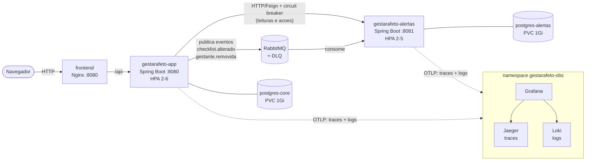

# Operacao em producao simulada (v5.0.0)

Guia para construir, executar, escalar, diagnosticar e remover o GestarAfeto em Docker e
Kubernetes. Todos os comandos abaixo foram executados neste repositorio; o que nao foi
validado esta marcado como tal em [`RASTREABILIDADE.md`](RASTREABILIDADE.md).

## 1. Arquitetura final



| Namespace | Conteudo |
|---|---|
| `gestarafeto-prod` | frontend, servico principal, alertas, 2 PostgreSQL, RabbitMQ, HPAs, PDBs, NetworkPolicies |
| `gestarafeto-obs` | Jaeger, Loki, Grafana |

Decisoes de projeto e a justificativa de cada uma:

| Decisao | Por que |
|---|---|
| Kustomize (base + overlay) em vez de Helm | Os manifests sao poucos e sem logica condicional; Kustomize vem embutido no `kubectl` e nao adiciona uma linguagem de template. |
| OpenTelemetry direto para Jaeger e Loki (sem OTel Collector) | Dois destinos e nenhum processamento no meio: o Collector seria um componente a mais sem funcao. Se surgir um terceiro destino, ele entra. |
| Logs por OTLP em vez de Promtail | Mesmo caminho no Compose e no Kubernetes, sem DaemonSet nem acesso a `/var/log` dos nos, e o `trace_id` ja chega ao Loki como metadado. |
| Sem Prometheus | Nao ha requisito de metricas alem do HPA, que usa o metrics-server do cluster. |
| Sem Ingress | O cluster local nao tem controlador; o acesso e por `port-forward`, que tambem evita expor Grafana/Jaeger/RabbitMQ. Em um cluster real, basta um Ingress para `gestarafeto-frontend:80`. |
| PostgreSQL e RabbitMQ em StatefulSet | Identidade estavel e PVC por replica. Uma replica cada: alta disponibilidade de banco esta fora do escopo. |
| `enableServiceLinks: false` | O Kubernetes injeta `GESTARAFETO_ALERTAS_PORT=tcp://…` por causa do Service de mesmo nome, e isso colide com a propriedade `server.port` do alertas. Foi um defeito real, encontrado no primeiro deploy. |

## 2. Pre-requisitos

- Docker (testado com Docker Desktop 29.x) e Docker Compose v2.
- Para Kubernetes: um cluster local. Validado no **Kubernetes do Docker Desktop** (node `desktop-control-plane`, v1.36) com `kubectl`; o CI usa **kind**.
- `metrics-server` no cluster (ja presente no Docker Desktop) para o HPA.
- Bash (Git Bash no Windows, ou WSL) para os scripts em `scripts/`.
- JDK 21 e Node 22 apenas para rodar testes/build fora do Docker.

## 3. Docker

### 3.1 Imagens

| Imagem | Dockerfile | Contexto | Base de execucao | Usuario |
|---|---|---|---|---|
| `gestarafeto/app` | `Dockerfile` | raiz | `eclipse-temurin:21-jre-alpine` | `spring` (1001) |
| `gestarafeto/alertas` | `alertas-service/Dockerfile` | `alertas-service/` | `eclipse-temurin:21-jre-alpine` | `spring` (1001) |
| `gestarafeto/frontend` | `frontend/Dockerfile` | `frontend/` | `nginx-unprivileged:1.27-alpine` | `nginx` (101) |

Builds em duas etapas: a primeira (Maven/Node) compila; a segunda contem so o necessario para
executar. Nos servicos Java o jar e extraido em camadas (`dependencies`, `spring-boot-loader`,
`snapshot-dependencies`, `application`), de modo que uma mudanca de codigo reconstroi apenas a
camada pequena. Cada contexto tem seu `.dockerignore`. Todos os Dockerfiles passam no
`hadolint`.

### 3.2 Executar com Docker Compose

```bash
docker compose --profile app up -d --build    # infraestrutura + 3 servicos + Jaeger/Loki/Grafana
docker compose --profile app ps               # todos "healthy"
bash scripts/smoke.sh                         # teste ponta a ponta
```

Sem `--profile app`, `docker compose up -d` sobe apenas bancos e RabbitMQ (fluxo de
desenvolvimento descrito no README).

| Endereco | O que e |
|---|---|
| http://localhost:3080 | Aplicacao (front-end, porta configuravel por `GESTARAFETO_FRONTEND_PORT`) |
| http://localhost:8080 / :8081 | Servico principal / microsservico de alertas |
| http://localhost:16686 | Jaeger |
| http://localhost:3001 | Grafana (`admin` / `admin`, ajuste com `GRAFANA_USER`/`GRAFANA_PASSWORD`) |
| http://localhost:15672 | Painel do RabbitMQ |

Configuracao 100% por variaveis de ambiente (modelo em `.env.example`; o `.env` real nao e
versionado). Os dados ficam em volumes nomeados e sobrevivem a `docker compose down`.

Parar e remover:

```bash
docker compose --profile app down        # preserva volumes (dados)
docker compose --profile app down -v     # apaga tambem os volumes
```

## 4. Kubernetes

### 4.1 Implantar

```bash
bash scripts/k8s-build-load.sh   # constroi as 3 imagens e as importa no containerd do no
bash scripts/k8s-up.sh           # namespaces, segredos, manifests, espera os rollouts
```

Por que `k8s-build-load.sh`: o Kubernetes local tem um containerd **proprio**, separado do
daemon Docker do host. Uma imagem construida no host nao e vista pelos pods ate ser importada,
e com `imagePullPolicy: IfNotPresent` reusar uma tag faria o cluster rodar uma imagem antiga
(isso aconteceu neste ambiente, com tags `5.0.x` que ja existiam no no). Por isso cada build
recebe uma tag nova (`5.0.0-<sha>`), gravada em `.image-tag` e lida pelo `k8s-up.sh`.

Variaveis uteis: `KUBE_CONTEXT` (padrao `docker-desktop`; com kind, `kind-<cluster>`),
`KIND_NODE` (container do no), `IMAGE_TAG`, `IMAGE_PREFIX` (usar imagens de um registry).

Os segredos (`gestarafeto-secrets`, `grafana-admin`) sao gerados aleatoriamente **uma unica
vez** pelo `k8s-up.sh` e nunca vao para o Git. Trocar a senha de um banco ja inicializado
quebraria o login, por isso o script nao os recria. Ler a senha do Grafana:

```bash
kubectl --context docker-desktop -n gestarafeto-obs get secret grafana-admin \
  -o jsonpath='{.data.password}' | base64 -d
```

### 4.2 Recursos criados

```bash
kubectl --context docker-desktop -n gestarafeto-prod get all,hpa,pdb,pvc,networkpolicy
kubectl --context docker-desktop -n gestarafeto-obs get all
```

| Recurso | Detalhe |
|---|---|
| Deployments | `gestarafeto-app`, `gestarafeto-alertas`, `gestarafeto-frontend` (2 replicas, `RollingUpdate` com `maxUnavailable: 0`) |
| StatefulSets | `postgres-core`, `postgres-alertas`, `rabbitmq`, `loki` (cada um com PVC) |
| Probes | `startup` + `readiness` + `liveness` nos servicos Java (`/actuator/health/{liveness,readiness}`); `/healthz` no Nginx; `pg_isready` e `rabbitmq-diagnostics ping` nos demais |
| Recursos | `requests` e `limits` de CPU e memoria em todo container |
| HPA | `gestarafeto-app` 2–6 e `gestarafeto-alertas` 2–5, alvo 70% de CPU, subida rapida e descida com 60 s de estabilizacao |
| PDB | `minAvailable: 1` em app, alertas e frontend |
| Seguranca | `runAsNonRoot`, `readOnlyRootFilesystem`, `drop: ALL`, `allowPrivilegeEscalation: false`, `seccomp: RuntimeDefault`, sem token de ServiceAccount; namespaces com Pod Security `enforce=baseline` / `warn=restricted` |
| NetworkPolicy | `default-deny-ingress` + liberacoes minimas (front→app, app→alertas, app→postgres-core, alertas→postgres-alertas, app/alertas→rabbitmq, namespace da aplicacao→Jaeger/Loki) |

### 4.3 Acessar

```bash
kubectl --context docker-desktop -n gestarafeto-prod port-forward svc/gestarafeto-frontend 13080:80   # http://localhost:13080
kubectl --context docker-desktop -n gestarafeto-prod port-forward svc/gestarafeto-app 18080:8080
kubectl --context docker-desktop -n gestarafeto-obs  port-forward svc/grafana 23000:3000
kubectl --context docker-desktop -n gestarafeto-obs  port-forward svc/jaeger 26686:16686
kubectl --context docker-desktop -n gestarafeto-prod port-forward svc/rabbitmq 15672:15672
```

> `port-forward` de um Service escolhe **um** pod no momento em que e aberto e nao acompanha
> substituicoes. Se o pod morrer (ou depois de um rollout), o encaminhamento cai: abra de novo.
> Isto afeta a medicao feita de fora do cluster, nao o servico. Para medir disponibilidade use
> um pod dentro do cluster (ver o roteiro).

### 4.4 Verificar a comunicacao entre servicos

```bash
APP_URL=http://localhost:18080 FRONT_URL=http://localhost:13080 bash scripts/smoke.sh
```

O script cria uma gestante, gera o checklist (servico principal → evento no RabbitMQ →
microsservico calcula os alertas) e le o resumo de volta (servico principal → alertas por HTTP).
Falha com codigo diferente de zero se qualquer elo quebrar.

### 4.5 Escalar

Manual (so em Deployments **sem** HPA, como o frontend; em app/alertas o HPA reverteria a mudanca):

```bash
kubectl --context docker-desktop -n gestarafeto-prod scale deployment/gestarafeto-frontend --replicas=4
```

Automatica (HPA) com o gerador de carga:

```bash
kubectl --context docker-desktop apply -f k8s/load-test/load-generator.yaml
kubectl --context docker-desktop -n gestarafeto-prod get hpa -w
kubectl --context docker-desktop delete -f k8s/load-test/load-generator.yaml     # ao terminar
```

### 4.6 Atualizar

Reexecute `k8s-build-load.sh` e `k8s-up.sh`. O `RollingUpdate` com `maxUnavailable: 0` troca
os pods um a um sem perder capacidade.

### 4.7 Interromper e remover

```bash
bash scripts/k8s-down.sh           # remove workloads; preserva PVCs, segredos e namespaces
bash scripts/k8s-down.sh --tudo    # remove os namespaces e, com eles, todos os dados
```

## 5. Problemas comuns

| Sintoma | Causa provavel | Solucao |
|---|---|---|
| Pod do alertas em `CrashLoopBackOff` com `Failed to convert … server.port` | Service links injetando `GESTARAFETO_ALERTAS_PORT=tcp://…` | Garantir `enableServiceLinks: false` (ja esta nos manifests) |
| Pods rodando codigo antigo apos `k8s-up.sh` | Tag reaproveitada com `IfNotPresent`; o no tem cache | Rodar `k8s-build-load.sh` (gera tag nova) antes do `k8s-up.sh` |
| `ErrImagePull`/`ImagePullBackOff` em `gestarafeto/*` | Imagem nao importada no no | `k8s-build-load.sh`; confirme `KIND_NODE` |
| `Bind for 127.0.0.1:3000 failed: port is already allocated` | Porta do host em uso | Mude `GESTARAFETO_FRONTEND_PORT` |
| `TLS handshake timeout` ao puxar imagens | Instabilidade de rede com o Docker Hub | Repetir `docker pull`; o build usa o cache depois |
| `HPA` mostra `<unknown>` | Metrics-server indisponivel ou pods ainda subindo | `kubectl top pods`; aguardar 1–2 min |
| `port-forward` deixa de responder | Pod encaminhado foi substituido | Abrir o `port-forward` de novo |
| Testcontainers ignorados / `Could not find a valid Docker environment` | Versao antiga do Testcontainers com Docker 29 | Ja corrigido (1.21.4); garanta que o Docker esteja rodando |
| Grafana sem dados de log | Exportacao OTLP desligada | `OTEL_EXPORT_ENABLED=true` (padrao nos manifests e no Compose) |
